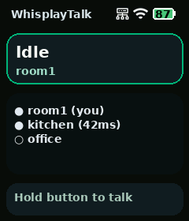
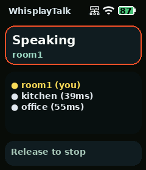
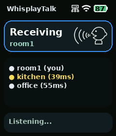

# whisplay-talk


[中文](README_CN.md)

A P2P voice intercom app for Whisplay HAT, designed for real-time voice broadcasting between multiple Whisplay devices.

Core flow:
- Runs as a `whisplay-daemon` app
- Discovers online devices concurrently through Tailscale `MagicDNS` and ESP-NOW heartbeats
- While one device holds the talk button, microphone audio is compressed and sent over every available TCP / ESP-NOW route
- Other devices play the audio in real time, highlight the active speaker, and show a receive icon in the status box
- While idle, the screen shows the device list with online state, heartbeat latency,
  and an explicit `[ESP]` or `[TCP]` transport label

## Screenshots

<p align="center">
  
  
  
</p>

## Interface Overview

- Header:
  Shows the `WhisplayTalk` title plus VPN, Wi-Fi signal, and battery status icons
- Status card:
  Shows the current app state, the local device name, the live `ESP CH n` radio
  channel, and a talk icon on the right while receiving audio
- Device list:
  Keeps showing the peer list even while talking or receiving, with online / offline markers, transport labels, and heartbeat latency such as `kitchen [TCP] (42ms)`
- Active speaker highlight:
  Highlights the device currently speaking in yellow
- Footer:
  Shows the current action hint such as `Hold button to talk`, `Release to stop`, or `Listening...`

## Current Implementation

The project currently uses the following design:

- Discovery:
  Polls `tailscale status --json` for devices whose hostname starts with `whisplay-talk-`, then probes the app TCP port on each device before marking it online and recording heartbeat latency
- Transport:
  All devices listen on fixed TCP port `24680` for audio streams
- Audio:
  Uses `arecord` / `aplay`, with default 16kHz / 16-bit / mono capture, `Opus` voice encoding, a small receive jitter buffer, and one-frame redundant resend
- Display:
  Uses Pillow to render a 240x280 UI into the framebuffer provided by `whisplay-daemon`, including header VPN / Wi-Fi / battery icons and a live peer list
- Input:
  Uses `whisplay-daemon` button events for push-to-talk

## Project Structure

```text
whisplay-talk/
├── main.py
├── application.py
├── config.py
├── audio/
├── display/
├── hardware/
├── network/
├── install.sh
├── run.sh
├── requirements.txt
└── .env.template
```

## Installation

```bash
git clone <this-repo>
cd whisplay-talk
bash install.sh
```

`install.sh` will:
- Install Python / ALSA utils / curl / `libopus0`
- Create a `venv`
- Install `Pillow` and `python-dotenv`
- Download the `NotoSansSC-Bold.ttf` font
- Auto-register the app if `whisplay-daemon` is detected

### Raspberry Pi Zero 2 W Nexmon firmware

The hardware-validated BCM43430/1 Nexmon firmware, CM5-built kernel modules,
DKMS source package, `nexutil`, boot service, checksums, and instructions are preserved
in [`firmware/nexmon-zero2w`](firmware/nexmon-zero2w/README.md). This setup keeps
normal managed Wi-Fi on `wlan0` while adding the same-channel `mon0` interface
for Radiotap/802.11 capture and injection.

### ESP-NOW transport

On a Zero 2 W with the bundled Nexmon firmware installed, install the privileged
radio bridge:

```bash
sudo bash tools/install_espnow_bridge.sh
```

Use the generated device name or set `WHISPLAY_TALK_DEVICE_NAME`, then launch Talk from
`whisplay-daemon`. Talk remains unprivileged and exchanges Unix datagrams with
the root bridge at `/run/whisplay-espnow/bridge.sock`. Discovery uses `WD01`
broadcast heartbeats and audio keeps the existing `WT01` format. ESP-NOW v1 is
limited to a 250-byte application payload; redundant audio is automatically
omitted when necessary. The current transport is broadcast, unencrypted, and
unauthenticated. `wlan0` and `mon0` coexist but must use the same Wi-Fi channel.
TCP/Tailscale and ESP-NOW are always started together; there is no transport
selector. If the fixed local bridge socket is absent, Talk continues with TCP.
Peer rows show `[ESP]`, `[TCP]`, or `[ESP/TCP]` according to their available routes.
When managed Wi-Fi is associated, ESP-NOW always follows the AP channel and never
changes it. When Wi-Fi is unassociated, every updated node falls back to channel 6.
After 12 seconds without a peer, the bridge performs a randomized low-duty recovery
scan over channels 1/6/11, announces immediately on every visited channel, and returns
both updated peers to channel 6 after discovery. This lets two nodes converge when
they boot away from any access point without disrupting an active Wi-Fi connection.
While offline, Nexmon scan suppression keeps NetworkManager background scans from
silently changing the ESP-NOW channel. The bridge briefly restores Wi-Fi scanning
once per minute while audio is idle so a configured access point can still reconnect.
For radio reliability, the bridge disables Wi-Fi power saving, uses 1 Mbps DSSS
with a long preamble, transmits each audio frame four times and each discovery
heartbeat seven times, and spaces replicas with jitter so one interference burst
cannot erase every copy. It also periodically refreshes the Nexmon pcap injection
handle and logs a smoothed peer RSSI every ten seconds for walk testing. The
Zero 2 W calibration data caps 2.4 GHz near 19.5 dBm; forcing the driver above
that calibrated limit is intentionally avoided. The default Opus bitrate is
12 kbps to shorten over-the-air frames.

Run the two-node application-layer smoke test simultaneously on both units:

```bash
venv/bin/python tools/espnow_app_smoke.py
```

### AtomS3R voice client

[`firmware/atom-s3r-whisplay-talk`](firmware/atom-s3r-whisplay-talk/README.md)
contains a standalone client for an M5Stack AtomS3R on the Atomic Voice Base.
It uses the same `WD01` discovery and `WT01`/Opus audio protocol as the Zero 2 W
bridge. The LCD shows state and peers; hold the screen button to talk and release
it to stop. The default build uses ESP-NOW channel 2 and the name `atomic-s3`.

`tools/espnow_audio_probe.py` sends a short Opus test tone from a Raspberry Pi to
an Atom client for repeatable receive/playback checks.

## Tailscale Setup

Every device must join the same Tailscale tailnet before `whisplay-talk` can discover peers.

Install Tailscale on Raspberry Pi:

```bash
curl -fsSL https://tailscale.com/install.sh | sh
sudo tailscale up
```

After `sudo tailscale up`, open the login URL shown in the terminal and complete the device login in your browser.

You can verify the connection with:

```bash
tailscale status
```

If Tailscale is not installed, not logged in, or not running, the app will show a matching reminder on screen.

## Configuration

First copy the config file:

```bash
cp .env.template .env
```

Important settings:

- `WHISPLAY_TALK_DEVICE_PREFIX`
  Default: `whisplay-talk-`
- `WHISPLAY_TALK_DEVICE_NAME`
  Optional explicit display name. When empty, the first app launch generates a
  friendly random name such as `amber-otter` and reuses it on later launches.
- `WHISPLAY_TALK_DEVICE_NAME_FILE`
  Default: `~/.config/whisplay-talk/device-name`, where an automatically generated
  name is persisted. Setting `WHISPLAY_TALK_DEVICE_NAME` always takes precedence.
- `WHISPLAY_TALK_TCP_PORT`
  Default: `24680`
- `WHISPLAY_TALK_APP_HEARTBEAT_TIMEOUT_MS`
  Default `3000`, timeout for peer online probing and latency measurement
- `WHISPLAY_TALK_APP_HEARTBEAT_FAILS_BEFORE_OFFLINE`
  Default `5`, number of consecutive failed heartbeat probes allowed before a peer is marked offline
- `ALSA_INPUT_DEVICE`
  Recording device. If unset, the app auto-detects `whisplaysound` first, with legacy Whisplay card names as a fallback before falling back to `default`
- `ALSA_OUTPUT_DEVICE`
  Playback device. If unset, the app auto-detects `whisplaysound` first, with legacy Whisplay card names as a fallback before falling back to `default`
- `AUDIO_CODEC`
  Default `opus`, recommended for current real-time talkback
- `AUDIO_FRAME_MS`
  Default `40`, which lowers packet rate and usually helps continuity on weaker links
- `AUDIO_REDUNDANCY_FRAMES`
  Default `1`, which resends the previous compressed frame to help recover a single lost packet
- `AUDIO_OPUS_BITRATE`
  Default `16000`, tuned for mono intercom voice with stronger continuity
- `AUDIO_OPUS_COMPLEXITY`
  Default `6`, still light enough for Raspberry Pi while improving encode quality a bit
- `AUDIO_OPUS_PACKET_LOSS_PERC`
  Default `15`, hints expected network loss to the Opus encoder
- `AUDIO_OPUS_ENABLE_FEC`
  Default `1`, enables Opus in-band forward error correction
- `WHISPLAY_TALK_RECEIVE_PREBUFFER_FRAMES`
  Standard-network default `24`, retaining the original roughly 960 ms jitter buffer
- `WHISPLAY_TALK_PLAYOUT_PREFILL_FRAMES`
  Standard-network default `6`, retaining the original 240 ms ALSA prefill
- `WHISPLAY_TALK_PLAYOUT_MISSING_GRACE_MS`
  Standard-network default `200`, retaining the original late-packet grace period
- `WHISPLAY_TALK_ESPNOW_RECEIVE_PREBUFFER_FRAMES`
  Default `4`, roughly 160 ms at the current 40 ms Opus frame size
- `WHISPLAY_TALK_ESPNOW_PLAYOUT_PREFILL_FRAMES`
  Default `1`, adding only one 40 ms silent device-priming frame for ESP-NOW
- `WHISPLAY_TALK_ESPNOW_PLAYOUT_MISSING_GRACE_MS`
  Default `0`; a missing ESP-NOW frame is concealed on its original deadline
  instead of pausing all following audio
- `AUDIO_PLAYER_BACKEND`
  Default `aplay`, which provides a stable 200 ms device buffer; `alsa` keeps the
  direct Python ALSA backend available for diagnostics

## Device Naming

Peer discovery is based on Tailscale `MagicDNS` hostnames. Devices are only considered talk peers when their hostname starts with `whisplay-talk-`.

Recommended naming pattern:

- `whisplay-talk-kitchen`
- `whisplay-talk-room1`
- `whisplay-talk-office`

The UI strips the `whisplay-talk-` prefix when showing device names, so `whisplay-talk-kitchen` is displayed as `kitchen`.

The recommended way to rename devices is directly in the Tailscale admin console, by editing each device name to match the `whisplay-talk-<name>` pattern.

For example:

- `whisplay-talk-kitchen`
- `whisplay-talk-room1`

After renaming a device in Tailscale, wait for the updated `MagicDNS` name to propagate to peers.

`WHISPLAY_TALK_DEVICE_NAME` can still be used as a local override when needed.
For ESP-NOW this is also the name broadcast to peers. TCP discovery continues to
use Tailscale MagicDNS names for remote devices.

Also make sure all devices have joined the same Tailscale tailnet.

## Run

```bash
bash run.sh
```

If `whisplay-daemon` is running on the system, it is recommended to launch `Talk` from the daemon app list.

For systems that do not use `whisplay-daemon`, you can configure boot startup with:

```bash
bash startup.sh
```

`startup.sh` installs a `systemd` service for this app. If it detects `whisplay-daemon`, it exits without making changes.

## Interaction

- While idle:
  The screen shows the device list, including self, online / offline markers, and peer heartbeat latency
- If Tailscale is not installed:
  The screen shows an install reminder
- If Tailscale is installed but not logged in or not running:
  The screen shows the matching login/start hint
- While holding the button:
  The local device enters `Speaking` and stops local playback to avoid echo
- After releasing the button:
  Sending stops and an end packet is broadcast
- When remote audio is received:
  The device enters `Receiving`, plays audio, shows who is speaking, and displays the talk icon on the right side of the status box

## Stream Packet Format

The current implementation uses a small custom packet header over a TCP stream:

- magic: `WT01`
- type: `1`
- flags:
  `1 = start`, `2 = end`
- sender name
- stream id
- sequence
- codec id
- compressed audio payload, typically `Opus`
- optional redundant payload for the previous frame

This makes it easy to evolve later toward:
- Unicast priority
- Push-to-talk arbitration
- Half-duplex / full-duplex strategy
- Stronger packet loss handling

## Known Limits

This is still an MVP, so a few practical limitations remain:

- The transport is still a custom TCP framing layer, not a standard voice/media protocol stack
- There is no explicit channel lock or arbitration yet; overlapping talk attempts are not coordinated
- Peer identity is still derived from the Tailscale hostname prefix, not from a separate nickname or contact system
- The best experience still assumes `whisplay-daemon`; `startup.sh` only helps boot the app on systems without the daemon, it does not recreate the daemon UI/runtime model

## License

This project is licensed under the GPL-3.0 license. See [LICENSE](LICENSE).
