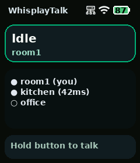
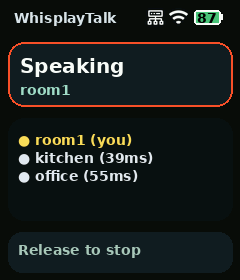
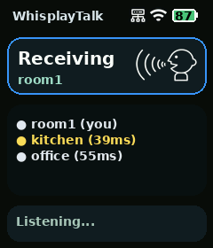

# whisplay-talk


[English](README.md)

基于 Whisplay HAT 的 P2P 语音对讲应用，面向多台 Whisplay 设备之间的局域化语音广播场景。

核心功能：
- 以 `whisplay-daemon` app 的形式接入和启动
- 基于 Tailscale `MagicDNS` 发现在线设备，约定设备名以 `whisplay-talk-` 开头
- 按住按钮讲话时，将麦克风音频压缩后通过 TCP 流实时发给所有在线 peer
- 其他设备实时播放，高亮当前说话设备，并在状态框显示接收图标
- 空闲时屏幕显示设备列表、在线状态和心跳延时

## 截图

<p align="center">
  
  
  
</p>

## 界面说明

- Header：
  显示 `WhisplayTalk` 标题，以及 VPN、Wi-Fi 信号、电池状态图标
- 状态框：
  显示当前 app 状态、本机设备名，以及接收音频时右侧的说话图标
- 设备列表：
  即使在讲话或接收时也持续显示 peer 列表，包含在线/离线标记和心跳延时，例如 `kitchen (42ms)`
- 当前讲话高亮：
  当前正在讲话的设备会以黄色高亮
- 底部提示：
  显示当前动作提示，例如 `Hold button to talk`、`Release to stop` 或 `Listening...`

## 当前实现

当前采用的技术方案如下：

- 发现：
  通过 `tailscale status --json` 找到主机名以 `whisplay-talk-` 开头的设备，再额外探测每台设备的 app TCP 端口，只有探测成功才标记为在线，并记录心跳延时
- 传输：
  所有设备监听固定 TCP 端口 `24680` 进行音频流传输
- 音频：
  使用 `arecord` / `aplay` 录放音，默认 16kHz / 16-bit / mono 采集，配合 `Opus` 语音编码、接收端轻量抖动缓冲，以及单帧冗余重发
- 显示：
  使用 Pillow 渲染 240x280 UI，并写入 `whisplay-daemon` 提供的 framebuffer，包含 header 的 VPN / Wi-Fi / 电池图标和动态设备列表
- 输入：
  通过 `whisplay-daemon` 的按钮事件实现按住说话

## 目录结构

```text
whisplay-talk/
├── main.py
├── application.py
├── config.py
├── audio/
├── display/
├── hardware/
├── network/
├── install.sh
├── run.sh
├── requirements.txt
└── .env.template
```

## 安装

```bash
git clone <this-repo>
cd whisplay-talk
bash install.sh
```

`install.sh` 会做这些事：
- 安装 Python / ALSA utils / curl / `libopus0`
- 创建 `venv`
- 安装 `Pillow` 和 `python-dotenv`
- 下载字体 `NotoSansSC-Bold.ttf`
- 在检测到 `whisplay-daemon` 时自动注册 app

## Tailscale 安装

所有设备都必须先加入同一个 Tailscale tailnet，`whisplay-talk` 才能发现彼此。

在树莓派上安装 Tailscale：

```bash
curl -fsSL https://tailscale.com/install.sh | sh
sudo tailscale up
```

执行 `sudo tailscale up` 后，终端会输出一个登录链接。用浏览器打开该链接并完成设备登录。

可以通过下面的命令确认是否已经连上：

```bash
tailscale status
```

如果设备没有安装 Tailscale、还没登录，或者服务没有运行，app 会在屏幕上显示对应提示。

## 配置

先复制配置文件：

```bash
cp .env.template .env
```

关键配置：

- `WHISPLAY_TALK_DEVICE_PREFIX`
  默认 `whisplay-talk-`
- `WHISPLAY_TALK_DEVICE_NAME`
  留空时自动取系统 hostname；如果 hostname 没有此前缀，会自动补上
- `WHISPLAY_TALK_TCP_PORT`
  默认 `24680`
- `WHISPLAY_TALK_APP_HEARTBEAT_TIMEOUT_MS`
  默认 `3000`，用于 peer 在线探测和延时测量的超时
- `WHISPLAY_TALK_APP_HEARTBEAT_FAILS_BEFORE_OFFLINE`
  默认 `5`，允许连续多少次心跳探测失败后才把 peer 标记为离线
- `ALSA_INPUT_DEVICE`
  录音设备。留空时会优先自动识别 `whisplaysound`，并兼容旧 Whisplay 卡名，找不到再回退到 `default`
- `ALSA_OUTPUT_DEVICE`
  播放设备。留空时会优先自动识别 `whisplaysound`，并兼容旧 Whisplay 卡名，找不到再回退到 `default`
- `AUDIO_CODEC`
  默认 `opus`，是当前这版实时对讲推荐配置
- `AUDIO_FRAME_MS`
  默认 `40`，降低发包频率，通常能改善弱链路下的连续性
- `AUDIO_REDUNDANCY_FRAMES`
  默认 `1`，会顺带重发上一帧压缩音频，用来补单帧丢包
- `AUDIO_OPUS_BITRATE`
  默认 `16000`，更偏向语音连续性
- `AUDIO_OPUS_COMPLEXITY`
  默认 `6`，在树莓派 CPU 开销和音质之间进一步做平衡
- `AUDIO_OPUS_PACKET_LOSS_PERC`
  默认 `15`，告诉 Opus 编码器按有丢包的链路来优化
- `AUDIO_OPUS_ENABLE_FEC`
  默认 `1`，开启 Opus 自带前向纠错
- `WHISPLAY_TALK_RECEIVE_PREBUFFER_FRAMES`
  默认 `24`，按当前 40ms Opus 帧约等于先缓存 1 秒再播放

## 设备命名

设备发现依赖 Tailscale `MagicDNS` 主机名。只有主机名以 `whisplay-talk-` 开头的设备，才会被识别为对讲 peer。

推荐命名方式：

- `whisplay-talk-kitchen`
- `whisplay-talk-room1`
- `whisplay-talk-office`

UI 显示时会自动去掉 `whisplay-talk-` 前缀，所以 `whisplay-talk-kitchen` 会显示成 `kitchen`。

更推荐直接在 Tailscale 管理后台修改设备名，把每台设备改成 `whisplay-talk-<name>` 这种形式。

例如：

- `whisplay-talk-kitchen`
- `whisplay-talk-room1`

在 Tailscale 后台改名后，等待新的 `MagicDNS` 名称同步到其他 peer 即可。

如果确实需要，也可以通过 `WHISPLAY_TALK_DEVICE_NAME` 单独覆盖本机 app 名称。

并确保这些设备都已经加入同一个 Tailscale tailnet。

## 运行

直接运行：

```bash
bash run.sh
```

如果系统里运行了 `whisplay-daemon`，建议从 daemon 的 app 列表进入 `Talk`。

如果设备不使用 `whisplay-daemon`，可以通过下面的脚本配置开机自启动：

```bash
bash startup.sh
```

`startup.sh` 会为当前应用安装一个 `systemd` 服务；如果检测到机器上已经有 `whisplay-daemon`，脚本会直接退出，不做额外配置。

## 交互说明

- 空闲时：
  屏幕显示设备列表，包含自己、在线/离线标记，以及 peer 心跳延时
- 如果设备没有安装 Tailscale：
  屏幕显示安装提醒
- 如果设备安装了 Tailscale 但未登录或未运行：
  屏幕显示对应的登录/启动提示
- 按住按钮：
  本机进入 `Speaking`，并先停掉本地播放，避免回音
- 松开按钮：
  停止发送，并发送一个结束包
- 远端收到音频：
  进入 `Receiving`，播放音频、显示谁在讲话，并在状态框右侧显示说话图标

## 音频流包格式

当前使用的是跑在 TCP 流上的轻量自定义包头：

- magic: `WT01`
- type: `1`
- flags:
  `1 = start`, `2 = end`
- sender name
- stream id
- sequence
- codec id
- 压缩音频 payload，当前默认是 `Opus`
- 可选的上一帧冗余 payload

这让我们后续很容易继续演进到：
- 单播优先级
- 对讲占线控制
- 半双工/全双工策略
- 更强的丢包恢复

## 已知边界

当前版本还是 MVP，当前比较明确的边界有这些：

- 传输层仍然是自定义 TCP 音频分帧，不是标准语音/媒体协议栈
- 还没有显式的占线锁或仲裁机制，多台设备同时抢麦时不会被协调管理
- 设备身份目前仍然直接从 Tailscale hostname 前缀派生，没有单独的昵称或联系人体系
- 最完整的体验仍然依赖 `whisplay-daemon`；`startup.sh` 只是帮助无 daemon 的系统开机启动 app，不等价于 daemon 那套 UI / runtime

## License

本项目采用 GPL-3.0 许可证。详见 [LICENSE](LICENSE)。
